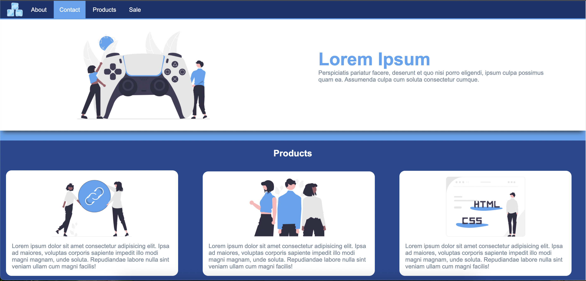
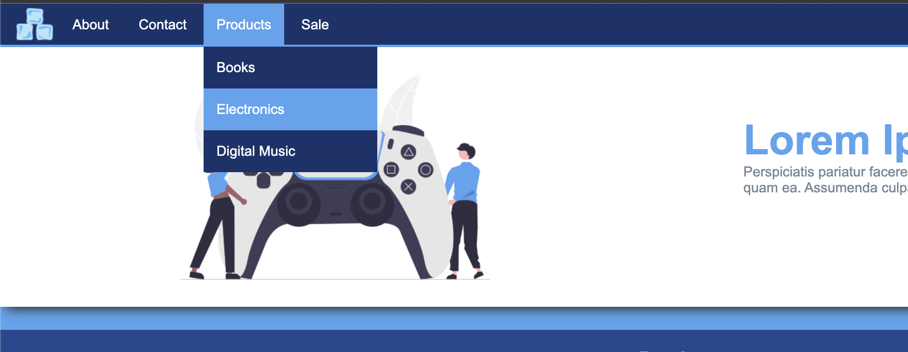

# Tasks

### Task1: HTML file
-   Create `index.html` file
-   Declare the document type of the HTML
-   Specify the character encoding for the HTML document
-   Add a title of the page
-   Add Favicon to the page
-   Add Link for your stylesheet file
-   Use semantic markup

### Task2: Content
-   Use the images from `images` folder
-   Add a logo image to header element
-   Create a navigation menu links
-   Create a product's content like the image below

### Task3: Stylesheet
-   Use linear-gradient for the background color of the entire page
-   The navigation elements should be horizontally aligned
-   The logo should be aligned to the left
-   Menu links have a background of #54a4f1 on hover
-   Hovering on **"Products"** navigation will show up a dropdown menu
-   Add a border-radius for the product boxes
-   For the product section stack the boxes next to each other using a display property
-   Do not use positioning for layout purposes

<!-- ## Instructions

- Create a webpage based on the provided design.
- In the images folder you will find all the assets you need.
- Make sure to add a favicon.
- Use semantic markup.
- Use linear-gradient for the background color of the entire page.
- Menu links have a background of #54a4f1 on hover.
- Hovering on "product" will show up a dropdown menu.
- For the product section stack the boxes next to each other using a display property.
- Do not use positioning for layout purposes.
- Use only the techniques covered so far. -->

## Layout

## Dropdown

[//]: # (autograding info start)
#  Results
> ⌛ Give it a minute. As long as you see the orange dot  on top, CodeBuddy is still processing. Refresh this page to see it's current status.
>
> This is what CodeBuddy found when running your code. It is to show you what you have achieved and to give you hints on how to complete the exercise.

### Task1: Check HTML structure

|                 Status                  | Check                                                                                    |
| :-------------------------------------: | :--------------------------------------------------------------------------------------- |
|  | `index.html` file exists |
|  | html document type declaration is present |
|  | Page should contain a `meta` tag with `charset` attribute |
|  | Page should contain a `title` tag with content |
|  | Page should contain a `link` tag with `rel="stylesheet"` attribute |
|  | Page should contain a `favicon` link |
|  | Page should contain `header` tag |
|  | Header should contain `nav` tag |

### Task2: check the content

|                 Status                  | Check                                                                                    |
| :-------------------------------------: | :--------------------------------------------------------------------------------------- |
|  | page header should contain logo image |
|  | Page navigation should contain links |
|  | Page should contain images |
|  | Page should contain paragraphs |

### Task3: Check styles

|                 Status                  | Check                                                                                    |
| :-------------------------------------: | :--------------------------------------------------------------------------------------- |
|  | The navigation element should be at the top of the page |
|  | The navigation elements should be horizontally aligned |
|  | The logo should be aligned to the left |
|  | The background color of the navigation Menu links should change when the mouse hovers over them |
|  | Hovering on "product" will show up a dropdown menu |
|  | The product boxes should have a border-radius |

[🔬 Results Details](../../actions)
[🐞 Tips on Debugging](https://github.com/DCI-EdTech/autograding-setup/wiki/How-to-work-with-CodeBuddy)
[📢 Report Problem](https://docs.google.com/forms/d/e/1FAIpQLSfS8wPh6bCMTLF2wmjiE5_UhPiOEnubEwwPLN_M8zTCjx5qbg/viewform?usp=pp_url&entry.652569746=UIB-boxmodel-coolDropdown)

[//]: # (autograding info end)